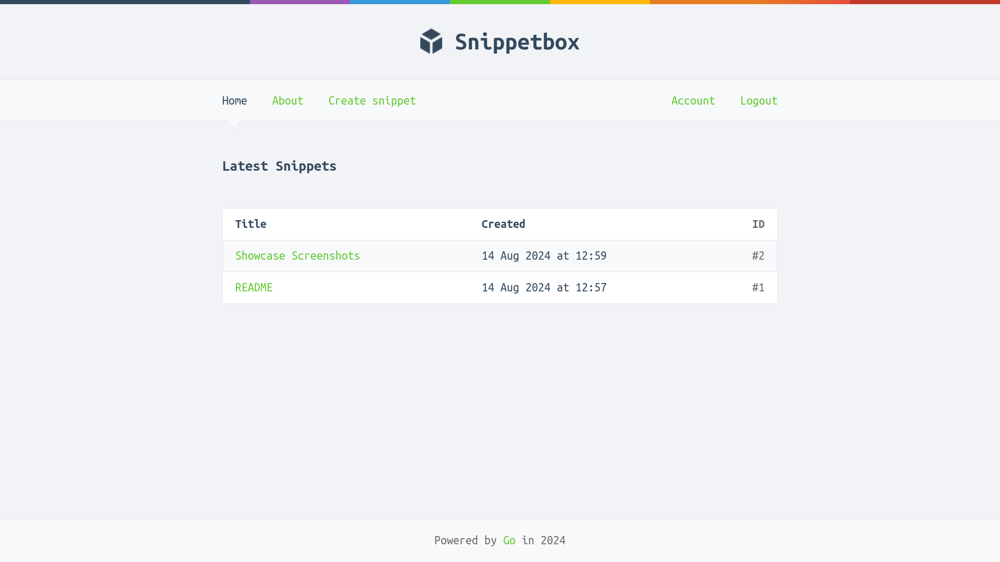
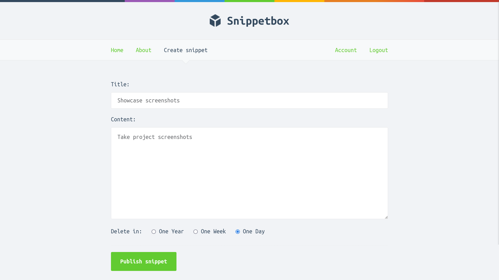
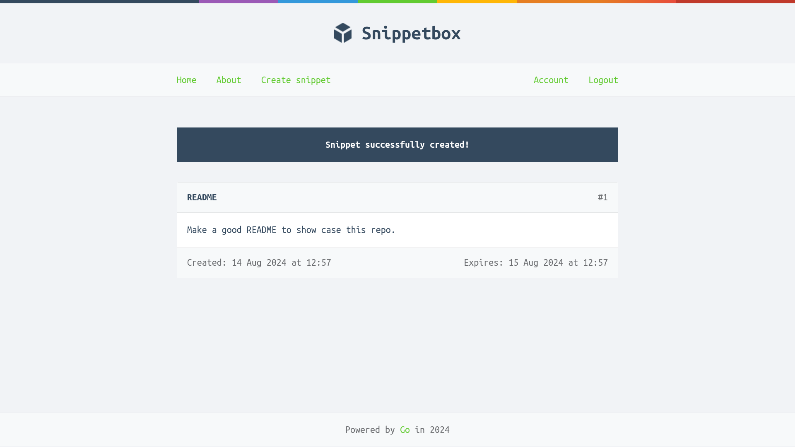
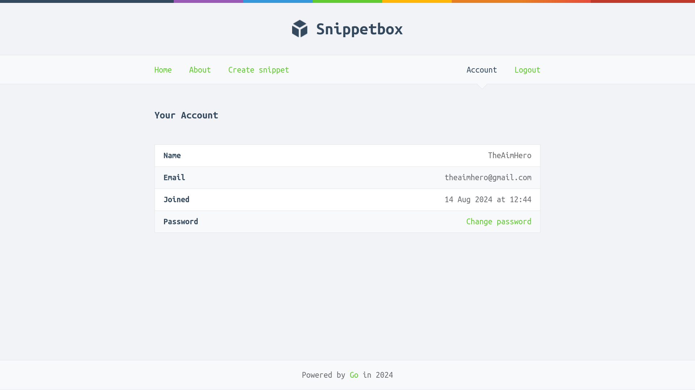

<a id="readme-top"></a>
[![Stargazers][stars-shield]][stars-url]
[![MIT License][license-shield]][license-url]
[![LinkedIn][linkedin-shield]][linkedin-url]

<!-- PROJECT LOGO -->
<br />
<div align="center">
  <h3 align="center">Snippet Box</h3>

  <p align="center">
    Snippets at a go
    <br />
    <a href="https://github.com/TheAimHero/snippetbox"><strong>Explore the docs »</strong></a>
    <br />
    <br />
  </p>
</div>

<!-- TABLE OF CONTENTS -->
<details>
  <summary>Table of Contents</summary>
  <ol>
    <li>
      <a href="#about-the-project">About The Project</a>
      <ul>
        <li><a href="#built-with">Built With</a></li>
      </ul>
    </li>
    <li>
      <a href="#getting-started">Getting Started</a>
      <ul>
        <li><a href="#prerequisites">Prerequisites</a></li>
        <li><a href="#installation">Getting it to run</a></li>
      </ul>
    </li>
    <li><a href="#usage">Usage</a></li>
    <li><a href="#license">License</a></li>
    <li><a href="#contact">Contact</a></li>
  </ol>
</details>

<!-- ABOUT THE PROJECT -->

## About The Project

[](https://github.com/TheAimHero/snippetbox)

<p align="right">(<a href="#readme-top">back to top</a>)</p>

### Built With


<p align="right">(<a href="#readme-top">back to top</a>)</p>

<!-- GETTING STARTED -->

## Getting Started

### Prerequisites

We assume that you already have Go and Docker installed. If not refer <a href="https://go.dev/doc/install">Install Go</a>, <a href="https://docs.docker.com/engine/install/">Install Docker</a>

### Installation

1. Clone the repo

```sh
git clone https://github.com/TheAimHero/snippetbox.git
cd snippetbox
```

2. Start the database and migrate it

   Install the migrate tool
   <br/>
   <a href="https://github.com/golang-migrate/migrate">Github migrate</a>

```sh
  docker compose up database
  migrate -database "your-db-connection-string" -path= migrations up
```

3. Start the server

```sh
docker compose up
```

4. Open `localhost:4000` in your browser

<p align="right">(<a href="#readme-top">back to top</a>)</p>

<!-- USAGE EXAMPLES -->

## Usage

### List of all snippets


### Create a snippet



### Created Snippt



### Account View



<p align="right">(<a href="#readme-top">back to top</a>)</p>

## Contributing

Contributions are what make the open source community such an amazing place to learn, inspire, and create. Any contributions you make are **greatly appreciated**.

If you have a suggestion that would make this better, please fork the repo and create a pull request. You can also simply open an issue with the tag "enhancement".
Don't forget to give the project a star! Thanks again!

1. Fork the Project
2. Create your Feature Branch (`git checkout -b feature/AmazingFeature`)
3. Commit your Changes (`git commit -m 'Add some AmazingFeature'`)
4. Push to the Branch (`git push origin feature/AmazingFeature`)
5. Open a Pull Request

### Top contributors:

<a href="https://github.com/TheAimHero/snippetbox/graphs/contributors">

</a>

<p align="right">(<a href="#readme-top">back to top</a>)</p>

<!-- LICENSE -->

## License

Distributed under the MIT License. See `LICENSE.txt` for more information.

<p align="right">(<a href="#readme-top">back to top</a>)</p>

<!-- CONTACT -->

## Contact

Project Link: [https://github.com/TheAimHero/snippetbox](https://github.com/TheAimHero/snippetbox)

<p align="right">(<a href="#readme-top">back to top</a>)</p>

[contributors-shield]: https://img.shields.io/github/contributors/TheAimHero/snippetbox.svg?style=for-the-badge
[contributors-url]: https://github.com/TheAimHero/snippetbox/graphs/contributors
[forks-shield]: https://img.shields.io/github/forks/TheAimHero/snippetbox.svg?style=for-the-badge
[forks-url]: https://github.com/TheAimHero/snippetbox/network/members
[stars-shield]: https://img.shields.io/github/stars/TheAimHero/snippetbox.svg?style=for-the-badge
[stars-url]: https://github.com/TheAimHero/snippetbox/stargazers
[license-shield]: https://img.shields.io/github/license/TheAimHero/snippetbox.svg?style=for-the-badge
[license-url]: https://github.com/TheAimHero/snippetbox/blob/master/LICENSE.txt
[linkedin-shield]: https://img.shields.io/badge/-LinkedIn-black.svg?style=for-the-badge&logo=linkedin&colorB=555
[linkedin-url]: https://linkedin.com/in/vedant-g-b1b806133
